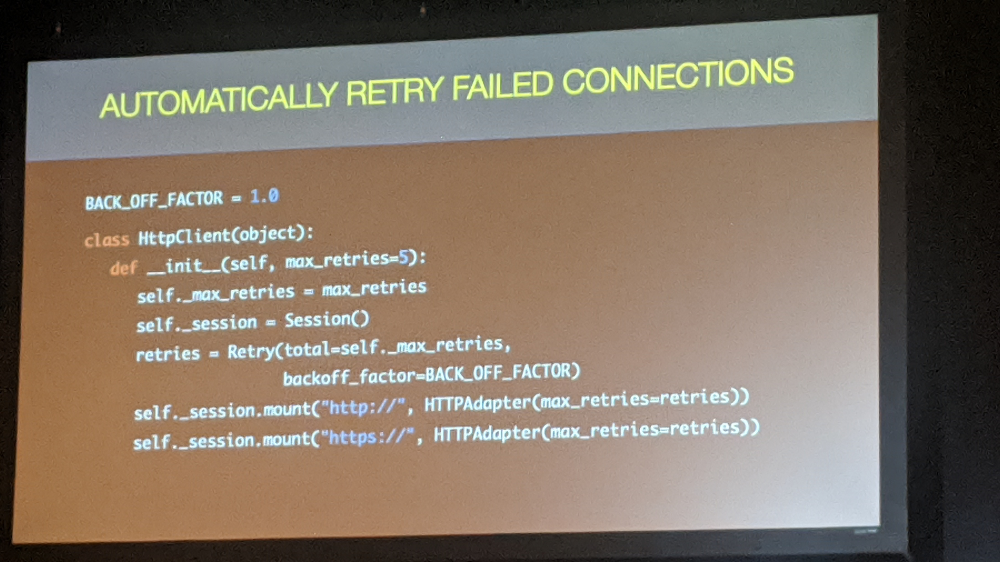
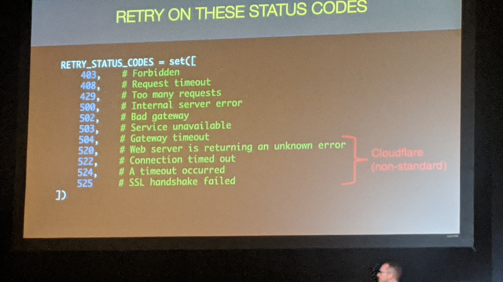
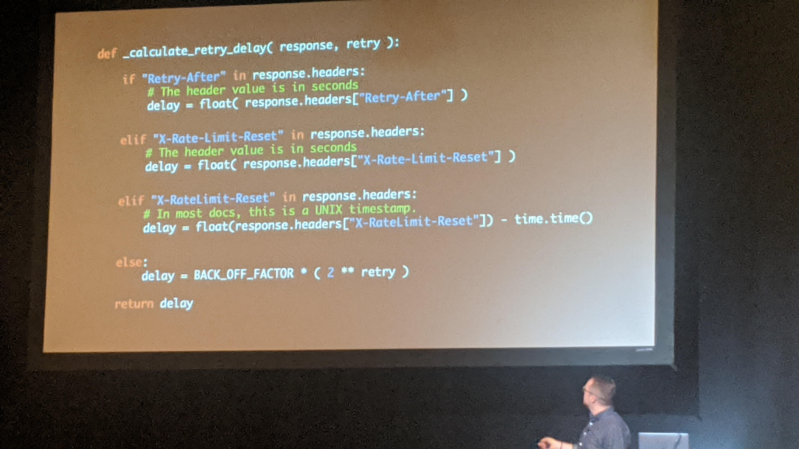

# Bulletproof Integrations : 5 tips to help you

Notes:

What is an integration:

1. Consolidating the data with your app and a third party service

Tip #1: Design for intermittent failure

* Your network connection is unreliable

* 3rd party unavaible

* API calls will fail unexpectedly

Tip #2 Build your own HTTP Client

* Vendor clients are problematic
  
  * Poor error handling
  
  * lack reconnect or retry logic
  
  * lack diagnostic logging
  
  * no telemetry
    
    * Track metrics

* Key features of our http Client
  
  * lightweight class that wrapped a requests session
  
  * Method for GET, POST, PUT, DELETE, PATCH
  
  * Automatic retry of failed connection and request
  
  * standard error handling and logging

Tip #3: Custo http adapter

* automatically retry failed connection 
  
  

Tip #4: Retry failed requests

- Retry on these status code
  
  -  
  
  - 

Tip #5: Log requests

- 

Tip #6: Persist request response data

- Add save unfiltered reponse
  
  - Cronjob to remove data older than 30 days old

