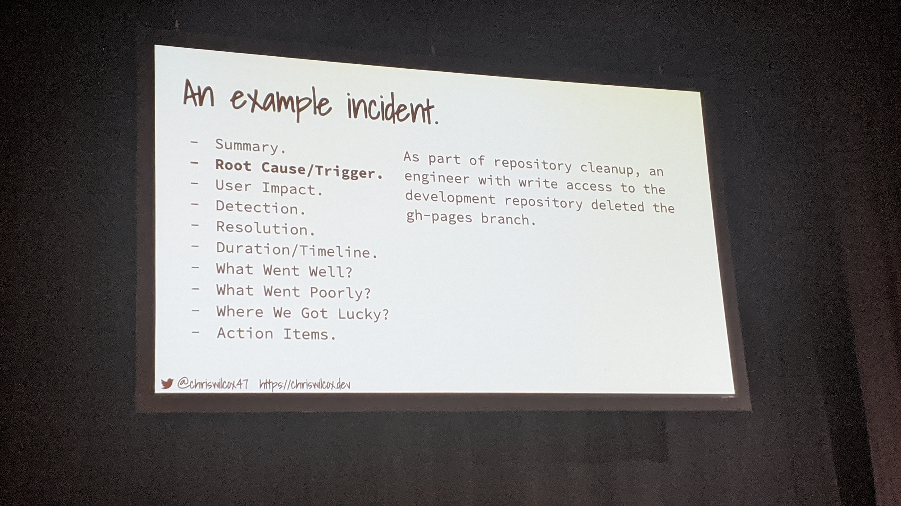

# The blameless post mortem: How embracing failure makes us better

Notes:

Post-mortem:

- Mortality and morbibity
  
  - Talks about what wrong happened
  
  - What were the path taken to fix the issue
  
  - What assumption were wrong and other were right
  
  - Education set instead of a round table looking at you

Only the people accountable directly that needs to be in a post-mortem, You don't want to talk about your faillures and how you messed up to your CTO - CEO or whatvever

5 steps POST-MORTEM:

1. Why this happens?

2. could it have been worse? better?

An examble of an incident:

action-items: What actions you need to take to make sure it never happens again!

TL;DR You don't need to mention the person that made the mistake

